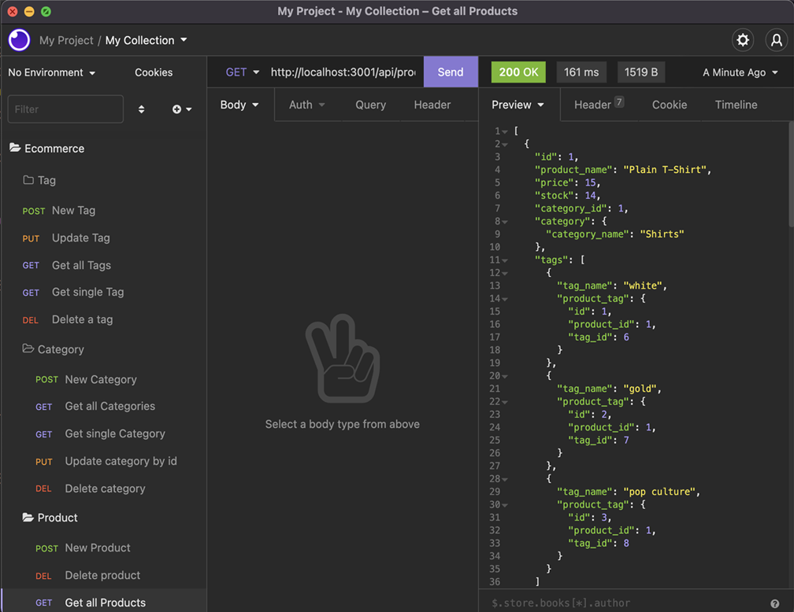
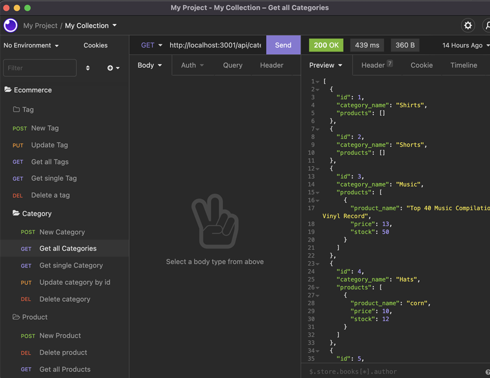
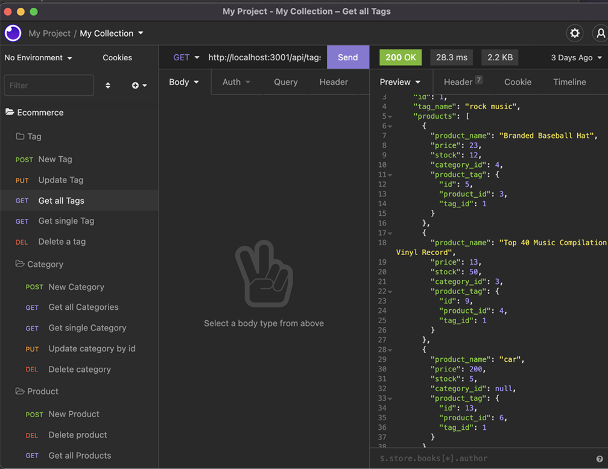

# E-Commerce Backend

## Description

An E-commerce backend built with Node.js, Express, Sequelize, and MySQL. Allows the user to access and update Products, Categories, and Tags

## Table of Contents

- [Installation](#Installation)
- [Usage](#Usage)
- [License](#License)
- [Credits](#Credits)
- [Questions](#Questions)

## Installation

-Create the database by running mysql with your login credentials, then the command `source db/schema.sql`.  
-Change the .envExample file to a .env file with your MySql login information.  
-Run `npm i` from the command line to install the local dependencies needed for this application.  
-Run `node seeds/index.js` to seed the database.  
-Run `npm start` to start the application.  
-Use the routes located in the routes folder to use various CRUD methods on the database

## Usage

After starting the application, the user is able to view, add, edit, and delete categories, products, and tags. Check out the files in the routes folder or watch the included video for a demonstration

  
  

## License

A short and simple permissive license with conditions only requiring preservation of copyright and license notices. Licensed works, modifications, and larger works may be distributed under different terms and without source code.

## Questions

If you have any questions, concerns, or comments, feel free to contact me:

-GitHub: [Zacharycampanelli](https://github.com/Zacharycampanelli)  
-Email: [zaccamp@optonline.net](mailto:zaccamp@optonline.net)

## Videos

-Installation: [Screencastify](https://drive.google.com/file/d/1MyrixMWNNXFbe1yMbrmpjPPOV56u77P4/view)  
-Part 1: [Screencastify](https://drive.google.com/file/d/1DTGv6gfGdMGQJRxa3V_JqZBnbwRxpnBQ/view)  
-Part 2: [Screencastify](https://drive.google.com/file/d/1IVIloOLw63BvFLdyYkyirUZDQNibf-Ra/view)
